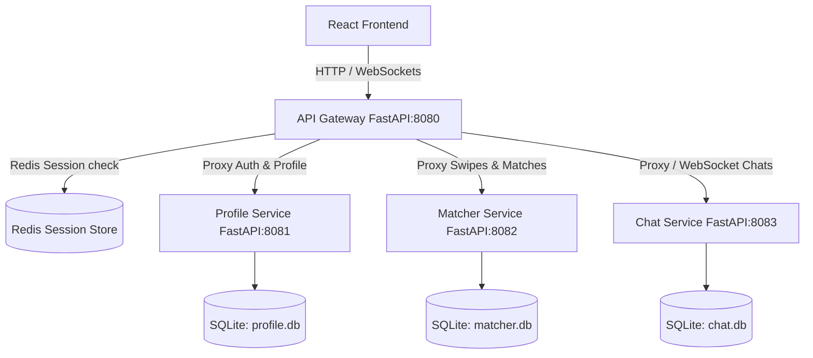

# Zinder MVP Architecture & Execution Blueprint

Zinder is a microservices-based connection platform for developers. This plan details the MVP architecture focusing on developer profile swiping, a dedicated project help request section, and SQLite database storage for simplified local development.

---

## Implementation status (Phase 2 — 2026-07-18)

| Area | Status | Notes |
|------|--------|-------|
| Profile service (8081) | **Done** | Auth verify, profiles, projects + lifecycle |
| Matcher service (8082) | **Done** | Browse scoring/sort/pagination, swipe, undo, matches |
| Chat service (8083) | **Done** | REST history/send/read + WebSocket fanout |
| API Gateway (8080) | **Done** | Proxies all of the above; WS bridge for chat |
| Internal service auth | **Done** | `X-Internal-Secret` required on all service routes |
| Password hashing | **Done** | bcrypt + SHA-256 → bcrypt rehash on login |
| Logout / `/auth/me` | **Done** | Cookie + Redis/memory session invalidation |
| Pytest unit suite | **Done** | `backend/tests/` (auth, chat, browse, projects, undo) |
| Notifications | Not started | Out of Phase 2 scope |
| Password reset / email verify | Not started | Contract stubs only |

### Critical security fix (item 0)

`GET /api/v1/profiles` on the profile service previously returned **every profile including emails with no auth**. It now requires `X-Internal-Secret` + `X-User-Id` and returns **public profiles without emails**. Direct port access without the secret returns `401`.

---

## System Architecture (MVP)

We will implement 4 backend services running locally, using **SQLite** for persistence and **Redis** for session management:



All gateway → service calls include:

- `X-Internal-Secret` (shared env `INTERNAL_SERVICE_SECRET`)
- `X-User-Id` (from validated session), when acting as a user

---

## API contract (Phase 2) — gateway base `http://localhost:8080/api/v1`

Auth: cookie `sessionId`. Protected routes require a valid session.

### Auth
| Method | Path | Request | Response |
|--------|------|---------|----------|
| POST | `/auth/register` | `{ email, password, name }` | `201 { id, email, name }` |
| POST | `/auth/login` | `{ email, password }` | `200 { id, email, name }` + Set-Cookie |
| POST | `/auth/logout` | — | `204` clears cookie + server session |
| GET | `/auth/me` | — | `200 { id, email, name }` or `401` |

### Profiles
| Method | Path | Response |
|--------|------|----------|
| GET | `/profiles/me` | Full profile incl. `lat`, `lng`, `last_active_at` |
| POST | `/profiles` | Create/update (same fields; optional `lat`/`lng`) |

### Discover / Matcher
| Method | Path | Query / body | Response |
|--------|------|--------------|----------|
| GET | `/matcher/browse` | `?cursor=&limit=20&sort=best\|newest\|nearby&tags=React,Go` | `{ items: [{ user_id, name, age, bio, image, interests[], looking_for, score, distance_km?, last_active_at?, lat?, lng? }], next_cursor }` |
| POST | `/matcher/swipe` | `{ swiped_id, action }` | `{ is_match, match_id?, swiper_id, swiped_id, action }` |
| DELETE | `/matcher/swipe/last` | — | `{ undone, swiped_id, action?, match_removed }` — `409` if match has chat activity |
| GET | `/matcher/matches` | — | match list (email redacted for non-self profile fetches) |

**Scoring (server):** Jaccard interest overlap (45%) + looking_for alignment (20%) + recency via `last_active_at` (15%) + distance decay vs `radius_limit` when lat/lng present (20%) → integer `score` 0–100.

### Chat
| Method | Path | Request | Response |
|--------|------|---------|----------|
| GET | `/chat/conversations/{match_id}/messages` | `?before=&limit=50` | `{ messages: [{ id, match_id, sender_id, text, created_at, read_at? }], next_before }` |
| POST | `/chat/conversations/{match_id}/messages` | `{ text }` | message object (+ WS fanout) |
| POST | `/chat/conversations/{match_id}/read` | `{ up_to_message_id }` | `204` |
| WS | `/chat/ws` | cookie auth; client `{ type: "subscribe", match_id }` | events: `message`, `typing`, `read`, `presence`, `subscribed` |

### Project Help
| Method | Path | Request | Response |
|--------|------|---------|----------|
| GET | `/projects` | — | `Project[]` (includes `status`, `helper_user_id`) |
| POST | `/projects` | `{ title, description, tech_stack[] }` | `Project` |
| GET | `/projects/{id}` | — | `Project` + `interested[]` + `comments[]` |
| PATCH | `/projects/{id}/status` | `{ status, helper_user_id? }` | `Project` |
| POST | `/projects/{id}/interested` | `{ note? }` | interest row |
| DELETE | `/projects/{id}/interested` | — | `204` |
| GET/POST | `/projects/{id}/comments` | `{ body }` on POST | comment list / comment |

**Status rules:** `pending → accepted → in_progress → completed` (forward only). Owner-only `cancelled` from pending/accepted/in_progress. Accept requires `helper_user_id` on the interested list. Owner or accepted helper may advance status.

---

## Contract deviations (front-end must know)

Documented deliberately — do not silently drift further.

1. **Path prefix:** All routes live under `/api/v1/...` (not bare `/chat/...`). The Phase-2 prompt’s short paths map 1:1 under this prefix.
2. **Login response shape:** Aligned to proposed contract `{ id, email, name }` + cookie. Previous `{ status, message, session_info }` wrapper is **removed**.
3. **Browse response shape:** Changed from a bare JSON **array** to `{ items, next_cursor }` per proposed contract. Clients that `Array.isArray(data)` must update.
4. **Browse cards:** No nested `user.email`. Public fields only + server `score`.
5. **Project `cancelled`:** Added beyond the four forward statuses so owner cancel is explicit (not a delete).
6. **Accept helper:** `PATCH .../status` with `status=accepted` **requires** `helper_user_id` (must already be interested).
7. **Seed auto-like-back** (`@zinder.internal`): **Disabled by default.** Enable only with `SEED_AUTO_LIKE=true` (dev/seed only).
8. **Chat match registration:** Matcher notifies chat via `POST /api/v1/internal/matches` when a match is created. Chat rejects messages for unknown match_ids (participant check).
9. **Profile list:** Not exposed on the public gateway. Internal `GET /api/v1/profiles` requires secret + user id and never returns emails.

---

## Key Design Specs

### 1. Swiping & Projects Scope
* **Developer Swiping**: Developers swipe on other developer profiles (matching their tech stack and interests).
* **Project Help Requests Section**: A dedicated tab/section in the UI where users can view and post project help requests (collaboration requests, code reviews, debugging assistance) without swiping.

### 2. Database & Infrastructure (SQLite & Local Ports)
* Each service manages its own SQLite file (`profile.db`, `matcher.db`, `chat.db`) under `backend/data/`.
* Microservices run locally as independent Python processes.
* No Docker / GitHub API for this MVP.

### 3. Schemas (current)

**profile.db**
- `users`: id, email, password_hash, name
- `profiles`: user_id, age, distance, bio, image, interests (JSON), looking_for, radius_limit, **lat**, **lng**, **last_active_at**
- `projects`: id, user_id, title, description, tech_stack (JSON), timestamp, **status**, **helper_user_id**
- `project_interested`: project_id, user_id, note, created_at
- `project_comments`: id, project_id, user_id, body, created_at

**matcher.db**
- `swipes`: id, swiper_id, swiped_id, action, timestamp
- `matches`: id, user1_id, user2_id, timestamp

**chat.db**
- `match_participants`: match_id, user1_id, user2_id
- `messages`: id, match_id, sender_id, text, created_at, read_at

---

## How to run

```bash
# Redis required for durable sessions (memory fallback exists)
redis-server

cd backend
pip install -r requirements.txt

# Four terminals (or process manager):
uvicorn profile_service.main:app --reload --port 8081
uvicorn matcher_service.main:app --reload --port 8082
uvicorn chat_service.main:app --reload --port 8083
uvicorn app.main:app --reload --port 8080
```

Env: see `backend/.env.example` (`INTERNAL_SERVICE_SECRET`, service URLs, `SEED_AUTO_LIKE`).

### Tests

```bash
cd backend
python3 -m pytest tests/ -v
```

---

## Verification Plan

### Automated Tests
- Unit tests in `backend/tests/` covering auth, chat, browse scoring/sort/pagination, project transitions, swipe undo.
- Legacy `test_integration.py` / `test_matcher_integration.py` remain smoke scripts (subprocess); prefer pytest.

### Manual Verification
- Start all four microservices + Redis; open `/docs` on each port.
- Register two users, set profiles with overlapping interests + lat/lng, browse with `sort=best`, confirm `score` present.
- Mutual like → match → chat REST + WS subscribe → send message → mark read.
- Undo last swipe before messaging; confirm `409` after messages exist.
- Project: interest → accept → in_progress → completed; reject illegal transitions; owner cancel.
