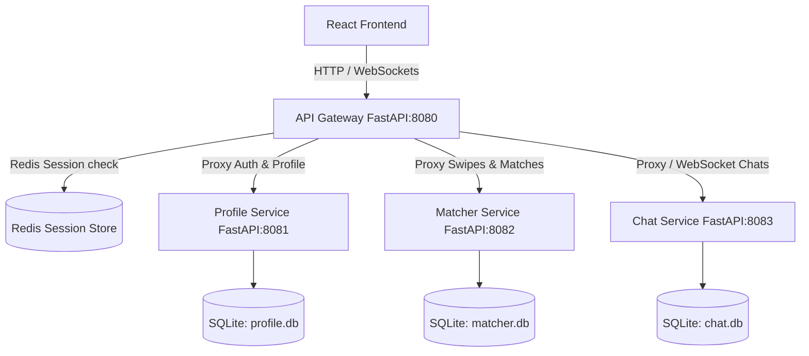

# Zinder MVP Architecture & Execution Blueprint

Zinder is a microservices-based connection platform for developers. This plan details the MVP architecture focusing on developer profile swiping, a dedicated project help request section, and SQLite database storage for simplified local development.

---

## System Architecture (MVP)

We will implement 4 backend services running locally, using **SQLite** for persistence and **Redis** for session management:

---

## Key Design Specs

### 1. Swiping & Projects Scope
* **Developer Swiping**: Developers swipe on other developer profiles (matching their tech stack and interests).
* **Project Help Requests Section**: A dedicated tab/section in the UI where users can view and post project help requests (collaboration requests, code reviews, debugging assistance) without swiping.

### 2. Database & Infrastructure (SQLite & Local Ports)
* Each service manages its own SQLite file (`profile.db`, `matcher.db`, `chat.db`) to preserve microservice isolation.
* Microservices run locally as independent Python processes communicating over local host ports.
* No Docker, Docker Compose, or GitHub API integration will be implemented for this MVP.

---

## Proposed Changes

We will build the MVP step-by-step:

### 1. Profile Service
Extract user profiles and project helper requests into a dedicated service.

- **FastAPI Port**: `8081`
- **Database**: `profile.db` (SQLite)
- **Schemas**:
  - `users`: `id`, `email`, `password_hash`, `name`
  - `profiles`: `user_id`, `age`, `distance`, `bio`, `image`, `interests` (JSON list), `looking_for`, `radius_limit`
  - `projects`: `id`, `user_id`, `title`, `description`, `tech_stack` (JSON list), `timestamp`

---

### 2. Matcher Service
Implement swiping storage and mutual match checks.

- **FastAPI Port**: `8082`
- **Database**: `matcher.db` (SQLite)
- **Schemas**:
  - `swipes`: `id`, `swiper_id`, `swiped_id`, `action` (`LIKE`/`PASS`), `timestamp`
  - `matches`: `id`, `user1_id`, `user2_id`, `timestamp`
- **Endpoints**:
  - `GET /api/v1/matcher/browse?userId=X`: Returns candidate developer profiles from Profile Service that user X hasn't swiped on yet.
  - `POST /api/v1/matcher/swipe`: Log swipe action. Returns status (and whether a mutual match was created).
  - `GET /api/v1/matcher/matches?userId=X`: Get matches for user X.

---

### 3. Chat Service
Handle real-time WebSocket messaging and database message storage.

- **FastAPI Port**: `8083`
- **Database**: `chat.db` (SQLite)
- **Schemas**:
  - `messages`: `id`, `match_id`, `sender_id`, `message_text`, `timestamp`
- **Endpoints**:
  - `GET /api/v1/chat/history?matchId=X`
  - WebSocket connection endpoint `ws://localhost:8083/api/v1/chat/ws/{matchId}`

---

### 4. API Gateway Refactoring
Update Gateway router logic to forward requests to the correct service ports.

- Route authentication/registration requests to the Profile Service (`localhost:8081`).
- Route swiping/browse requests to the Matcher Service (`localhost:8082`).
- WebSocket handshake upgrades for chat requests to the Chat Service (`localhost:8083`).

---

### 5. Frontend Enhancements
Bind the UI components to Gateway endpoints and add the new Project Help section.

- Connect swiping gestures to hit `POST /api/v1/matcher/swipe`.
- Connect message logs to a real WebSocket gateway.
- Add a new **Project Help Requests** tab/page containing lists of posted developer help requests and a form to submit a request.

---

## Verification Plan

### Automated Tests
- Run unit tests on each microservice using `pytest` and SQLite in-memory databases.
- Test endpoint integrations with gateway routing using `httpx`.

### Manual Verification
- Start all four microservices and verify API documentation pages (`/docs`).
- Register two users, swipe right on each other, verify mutual match status, and conduct a WebSocket-based chat session.
